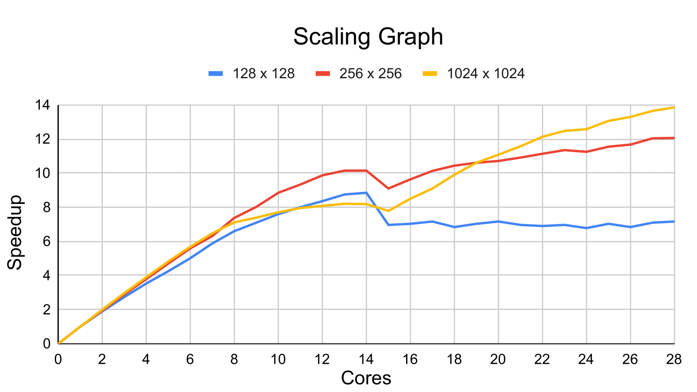
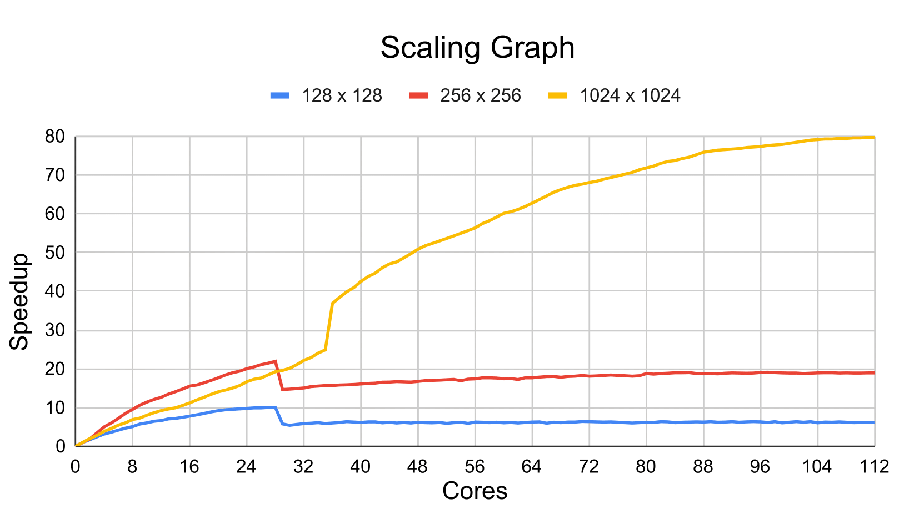
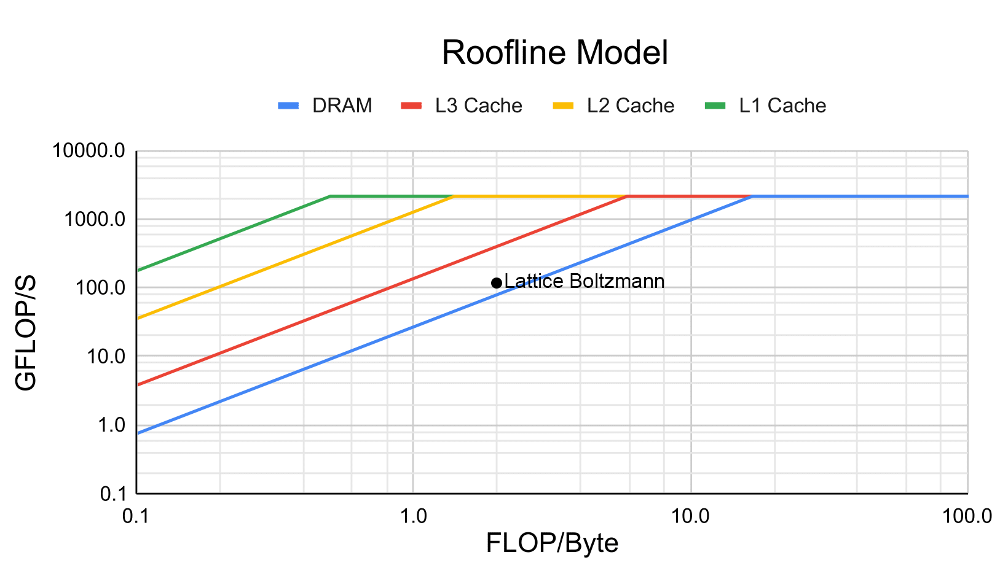
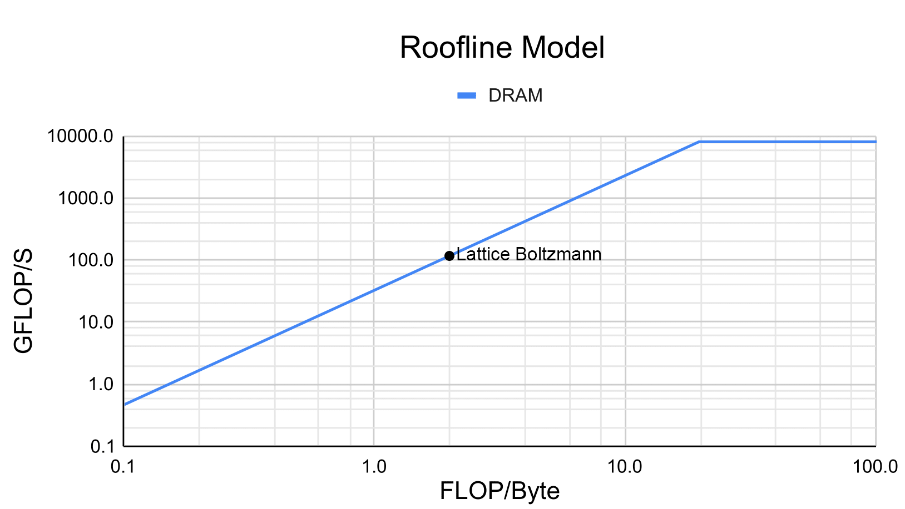

# High Performance Lattice Boltzmann
A high performance lattice Boltzmann fluid simulator operating in 2 dimensions with 9 speeds, optimised for both shared memory & distributed memory platforms as well as homogeneous & heterogeneous platforms. Consisting of 3 separate implementations which together comprise the major parallel programming paradigms of OMP, OCL & MPI. Further detail can be found in the following reports [1](Report_1.pdf) [2](Report_2.pdf).

|Simulation|
|----------|
||

|OMP Scaling|MPI Scaling|
|-----------|-----------|
|||

|OMP Roofline|OCL Roofline|MPI Roofline|
|------------|------------|------------|
||||